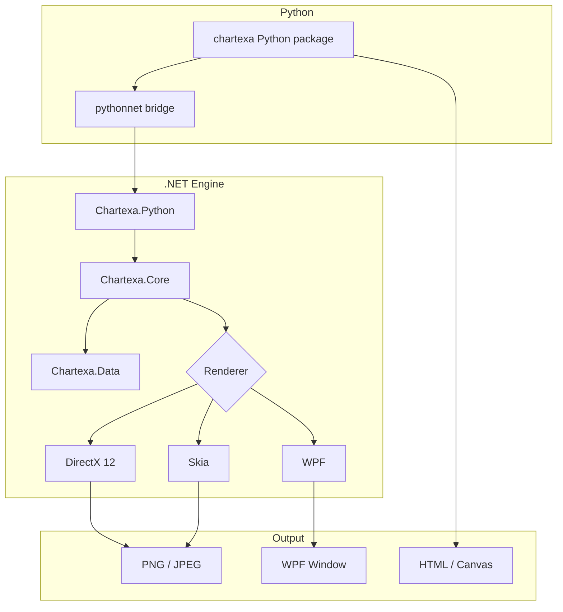

# System Overview

## Summary

Chartexa is a high-performance charting engine built in C# with multiple rendering backends. The Python wrapper provides a Pythonic API that bridges to the .NET engine via pythonnet.

---

## Architecture Diagram

---

## Layer Responsibilities

| Layer | Package | Responsibility |
|---|---|---|
| **Python API** | `chartexa` (PyPI) | Fluent builder, marshalling, Jupyter integration |
| **Bridge** | `Chartexa.Python` | .NET-side helpers for Python interop |
| **Core** | `Chartexa.Core` | Chart surface, axes, series, annotations, modifiers |
| **Data** | `Chartexa.Data` | Data series containers (XY, OHLC) |
| **Rendering** | `Chartexa.Rendering.*` | DirectX 12, Skia, WPF renderers |
| **HTML Export** | `chartexa._html` (Python) | Canvas-based HTML rendering with interactivity |

---

## Data Flow

1. **Python** -- user creates `Chart`, adds series via fluent methods
2. **Marshalling** -- Python arrays are converted to .NET arrays via pythonnet
3. **Data Series** -- .NET `XyDataSeries` / `OhlcDataSeries` hold the data
4. **Renderable Series** -- .NET series objects define visual properties (colour, thickness)
5. **Chart Surface** -- orchestrates axes, series, annotations
6. **Renderer** -- produces pixels (DirectX 12 GPU pipeline or Skia CPU)
7. **Output** -- PNG/JPEG bytes, HTML string, or WPF visual

---

## Key Design Decisions

- **Separation of data and rendering** -- DataSeries holds raw values; RenderableSeries defines visual style
- **Fluent API** -- Python wrapper returns `self` from every method for chaining
- **Auto-detection** -- axis ranges, renderer selection, and notebook environment are auto-detected
- **Theme system** -- centralised visual configuration via theme presets
- **HTML export** -- self-contained HTML with Canvas rendering for web/notebook distribution

---

## Related

- [Rendering Pipeline](rendering-pipeline.md)
- [Coordinate System](coordinate-system.md)

---

> **Last updated:** 2026-06-10 14:00 UTC | **Status:** published
